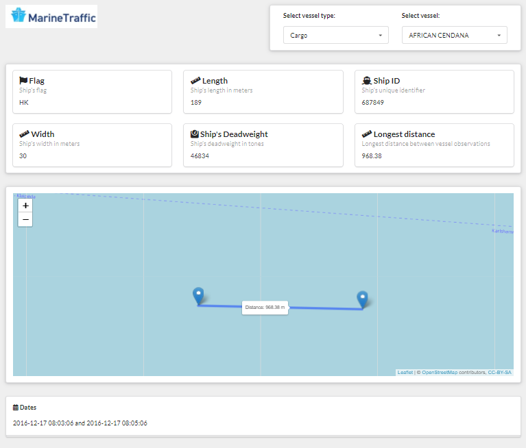

<!-- README.md is generated from README.Rmd. Please edit that file -->

```{r, include = FALSE}
knitr::opts_chunk$set(
  collapse = TRUE,
  comment = "#>",
  fig.path = "man/figures/README-",
  out.width = "100%"
)

library(tidyverse)
library(kableExtra)
library(gt)

load("data/data_description.rda")
marine_raw <- readr::read_csv(unz("./data-raw/marineData.zip", "ships.csv"))
```

# MarineDashboard

<!-- badges: start -->

[](https://lifecycle.r-lib.org/articles/stages.html#experimental) [](https://github.com/Eduardodudu/MarineDashboard/actions)

<!-- badges: end -->

This project aims to design a dashboard using `shiny.semantics` of the [marine dataset](https://www.marinetraffic.com/blog/information-transmitted-via-ais-signal/)

[](https://eduardodudu.shinyapps.io/MarineDashboard/)

## Data structure

Marine dataset has `r nrow(marine_raw)` rows and `r ncol(marine_raw)` variables with the following structure:

```{r Data structure, echo = F}
gt(data_description[,1:2])
```

The data is a log of the [AIS signal](https://www.marinetraffic.com/blog/information-transmitted-via-ais-signal/) that renders each vessel position under a frequency of time.

### Analysis

1.  There were found cases of conflict between SHIP_ID and SHIPNAME, in theory SHIP_ID is unique and therefore should have a unique name as well as for SHIPNAME having a single SHIP_ID

```{r SHIP_ID, echo = F}

marine_raw %>% 
   distinct(SHIP_ID, SHIPNAME) %>% 
   group_by(SHIP_ID) %>% 
   summarise(n = n(),
             Last_SHIPNAME = last(SHIPNAME)) %>% 
   filter(n> 1) %>% 
   arrange(-n) %>% 
   head(5) %>% 
   gt()
         

```

The same happens under SHIPNAME:

```{r SHIP_NAME, echo = F}

marine_raw %>% 
     distinct(SHIP_ID, SHIPNAME) %>% 
     group_by(SHIPNAME) %>% 
     summarise(n = n(), Select_ID = last(SHIP_ID)) %>% 
     filter(n> 1) %>% 
     arrange(-n) %>% 
     head(5) %>% 
     gt()

```

These inconsistencies were not treated and should be kept on track for deployment.

2. Relationship between IS_PARKED and SPEED hold beyond the speed of 3 knots. It is safe then to assume that IS_PARKED can be used to filter out cases of vessels that are not in movement.

### Treatments

In order to run into shiny, the data was cleaned based out of the cases:

1. Removed the cases of vessels in movement `IS_PARKED = 0` leading to 333.188 observations, a reduction of 90%  under the raw data.
2. Removed 6 cases of vessels that had only one signal despite being in movement that would cause issues to the max distance calculation.
3. Calculated the max distance beforehand, returning to the app only the data needed for the dashboard, leading to 2.020 observations. A reduction of 99% under the silver data (Parked data)


