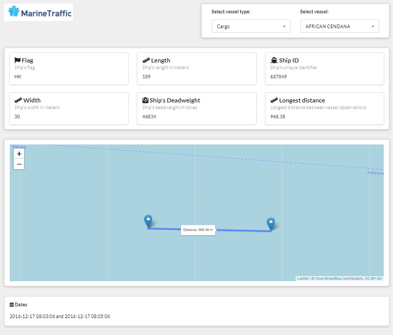

<!-- README.md is generated from README.Rmd. Please edit that file -->

# MarineDashboard

<!-- badges: start -->

<!-- badges: end -->

This project aims to design a dashboard using `shiny.semantics` of the
[marine
dataset](https://www.marinetraffic.com/blog/information-transmitted-via-ais-signal/)

## Data structure

Marine dataset has 3102887 rows and 20 variables with the following
structure:

<table>
<thead>
<tr>
<th style="text-align:left;">
ID
</th>
<th style="text-align:left;">
Description
</th>
</tr>
</thead>
<tbody>
<tr>
<td style="text-align:left;">
LAT
</td>
<td style="text-align:left;">
Ship’s latitude
</td>
</tr>
<tr>
<td style="text-align:left;">
LON
</td>
<td style="text-align:left;">
Ship’s longitude
</td>
</tr>
<tr>
<td style="text-align:left;">
SPEED
</td>
<td style="text-align:left;">
Ship’s speed in knots
</td>
</tr>
<tr>
<td style="text-align:left;">
COURSE
</td>
<td style="text-align:left;">
Ship’s course as angle
</td>
</tr>
<tr>
<td style="text-align:left;">
HEADING
</td>
<td style="text-align:left;">
Ship’s compass direction
</td>
</tr>
<tr>
<td style="text-align:left;">
DESTINATION
</td>
<td style="text-align:left;">
Ship’s destination (reported by the crew)
</td>
</tr>
<tr>
<td style="text-align:left;">
FLAG
</td>
<td style="text-align:left;">
Ship’s flag
</td>
</tr>
<tr>
<td style="text-align:left;">
LENGTH
</td>
<td style="text-align:left;">
Ship’s length in meters
</td>
</tr>
<tr>
<td style="text-align:left;">
SHIPNAME
</td>
<td style="text-align:left;">
Ship’s name
</td>
</tr>
<tr>
<td style="text-align:left;">
SHIPTYPE
</td>
<td style="text-align:left;">
Ship’s type
</td>
</tr>
<tr>
<td style="text-align:left;">
SHIPID
</td>
<td style="text-align:left;">
Ship’s unique identifier
</td>
</tr>
<tr>
<td style="text-align:left;">
WIDTH
</td>
<td style="text-align:left;">
Ship’s width in meters
</td>
</tr>
<tr>
<td style="text-align:left;">
DWT
</td>
<td style="text-align:left;">
Ship’s deadweight in tones
</td>
</tr>
<tr>
<td style="text-align:left;">
DATETIME
</td>
<td style="text-align:left;">
Date and time of the observation
</td>
</tr>
<tr>
<td style="text-align:left;">
PORT
</td>
<td style="text-align:left;">
Current port reported by the vessel
</td>
</tr>
<tr>
<td style="text-align:left;">
Date
</td>
<td style="text-align:left;">
Date extracted from DATETIME
</td>
</tr>
<tr>
<td style="text-align:left;">
Weeknb
</td>
<td style="text-align:left;">
Week number extracted from date
</td>
</tr>
<tr>
<td style="text-align:left;">
Shiptype
</td>
<td style="text-align:left;">
Ship’s type from SHIPTYPE
</td>
</tr>
<tr>
<td style="text-align:left;">
Port
</td>
<td style="text-align:left;">
Current port assigned based on the ship’s location
</td>
</tr>
<tr>
<td style="text-align:left;">
Isparked
</td>
<td style="text-align:left;">
Indicator whether the ship is moving or not
</td>
</tr>
<tr>
<td style="text-align:left;">
longestdistance
</td>
<td style="text-align:left;">
Longest distance between vessel observations
</td>
</tr>
</tbody>
</table>

The data is a log of the [AIS
signal](https://www.marinetraffic.com/blog/information-transmitted-via-ais-signal/)
that renders each vessel position under a frequency of time.

### Analysis

1.  There were found cases of conflict between SHIP\_ID and SHIPNAME, in
    theory SHIP\_ID is unique and therefore should have a unique name as
    well as for SHIPNAME having a single SHIP\_ID

<table>
<caption>
Top 5 cases
</caption>
<thead>
<tr>
<th style="text-align:right;">
SHIPID
</th>
<th style="text-align:right;">
n
</th>
<th style="text-align:left;">
LastSHIPNAME
</th>
</tr>
</thead>
<tbody>
<tr>
<td style="text-align:right;">
4666609
</td>
<td style="text-align:right;">
6
</td>
<td style="text-align:left;">
BLACKPEARL 7.3V
</td>
</tr>
<tr>
<td style="text-align:right;">
315731
</td>
<td style="text-align:right;">
2
</td>
<td style="text-align:left;">
BBAS
</td>
</tr>
<tr>
<td style="text-align:right;">
315950
</td>
<td style="text-align:right;">
2
</td>
<td style="text-align:left;">
WLA-311
</td>
</tr>
<tr>
<td style="text-align:right;">
316404
</td>
<td style="text-align:right;">
2
</td>
<td style="text-align:left;">
KM ,TAN BORCHARDT
</td>
</tr>
<tr>
<td style="text-align:right;">
316482
</td>
<td style="text-align:right;">
2
</td>
<td style="text-align:left;">
WXA A SZCZESCIA
</td>
</tr>
</tbody>
</table>

The same happens under SHIPNAME:

<table>
<caption>
Top 5 cases
</caption>
<thead>
<tr>
<th style="text-align:left;">
SHIPNAME
</th>
<th style="text-align:right;">
n
</th>
<th style="text-align:right;">
SelectID
</th>
</tr>
</thead>
<tbody>
<tr>
<td style="text-align:left;">
SATAIS
</td>
<td style="text-align:right;">
19
</td>
<td style="text-align:right;">
2.866114e+14
</td>
</tr>
<tr>
<td style="text-align:left;">
ALANA
</td>
<td style="text-align:right;">
2
</td>
<td style="text-align:right;">
3.484650e+05
</td>
</tr>
<tr>
<td style="text-align:left;">
AMANDA
</td>
<td style="text-align:right;">
2
</td>
<td style="text-align:right;">
3.233550e+05
</td>
</tr>
<tr>
<td style="text-align:left;">
ARGO
</td>
<td style="text-align:right;">
2
</td>
<td style="text-align:right;">
3.653787e+06
</td>
</tr>
<tr>
<td style="text-align:left;">
AURA
</td>
<td style="text-align:right;">
2
</td>
<td style="text-align:right;">
3.460220e+05
</td>
</tr>
</tbody>
</table>

These inconsistencies were not treated and should be kept on track for
deployment.

1.  Relationship between IS\_PARKED and SPEED hold beyond the speed of 3
    knots. It is safe then to assume that IS\_PARKED can be used to
    filter out cases of vessels that are not in movement.

### Treatments

In order to run into shiny, the data was cleaned based out of the cases:

1.  Removed the cases of vessels in movement `IS_PARKED = 0` leading to
    333.188 observations, a reduction of 90% under the raw data.
2.  Removed 6 cases of vessels that had only one signal despite being in
    movement that would cause issues to the max distance calculation.
3.  Calculated the max distance beforehand, returning to the app only
    the data needed for the dashboard, leading to 2.020 observations. A
    reduction of 99% under the silver data (Parked data)
